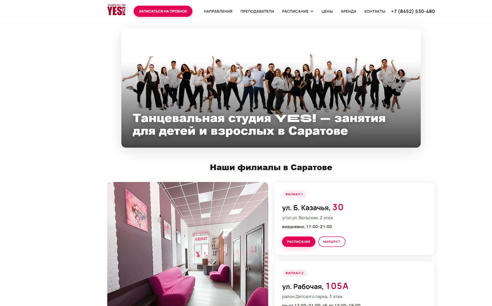
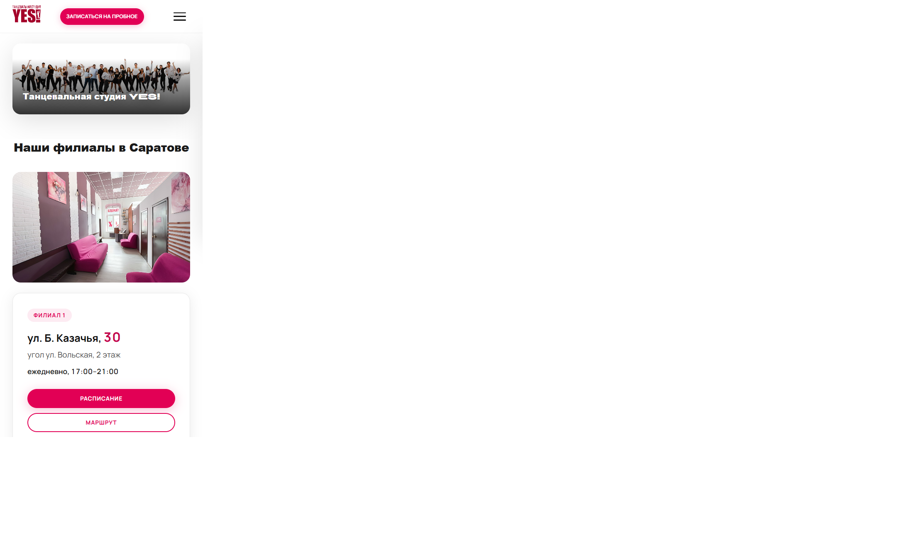
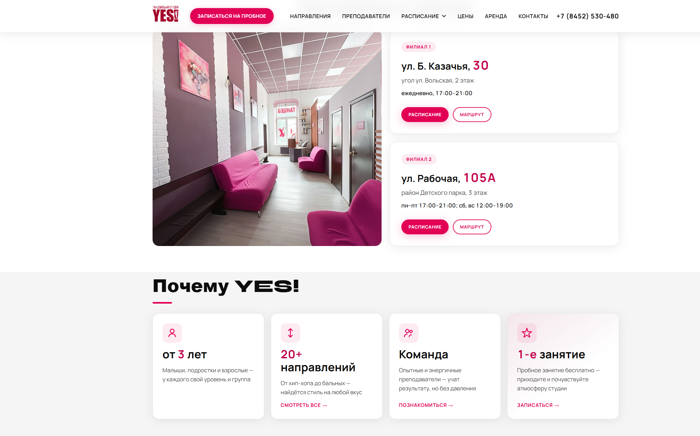

# YES! Dance Studio — новая главная страница (прототип)

Прототип обновлённой главной страницы танцевальной студии YES! в Саратове.  
Цель — показать, как может выглядеть и работать сайт, который **приводит родителей к записи на бесплатное пробное занятие**.

**Текущий сайт:** [yesds.ru](https://www.yesds.ru)  
**Репозиторий:** [github.com/AnyaZhuk/YES_DanceStudio](https://github.com/AnyaZhuk/YES_DanceStudio)

---

## Зачем это нужно

Сейчас на [yesds.ru](https://www.yesds.ru) сложно с первого экрана понять, куда записаться, где филиалы и почему стоит выбрать YES!. На телефоне это особенно заметно — а большинство родителей ищут «танцы для детей в Саратове» именно с мобильного.

Новая главная решает три задачи:

1. **Запись** — кнопка «Записаться на пробное» всегда на виду, форма внизу страницы.
2. **Доверие** — филиалы, фото студии, ответы на частые вопросы, контакты.
3. **Поиск** — заголовки и тексты заточены под запросы в Google и Яндексе.

> Это **прототип главной страницы**, а не готовый продакшен. Внутренние разделы (направления, расписание, цены и т.д.) — следующий этап работ.

---

## Посмотреть прототип

**Онлайн (GitHub Pages):**  
[https://anyazhuk.github.io/YES_DanceStudio/](https://anyazhuk.github.io/YES_DanceStudio/)

> Если ссылка не открывается — в настройках репозитория GitHub включите **Pages → Source: main branch → / (root)**.

**Локально:** откройте файл [`index.html`](index.html) в браузере (двойной клик или «Open with Live Server»).

---

## Скриншоты

| Десктоп | Мобильная |
| --- | --- |
|  |  |

---

## Что изменилось по сравнению с текущим сайтом

| Было | Стало в прототипе |
| --- | --- |
| Устаревшая вёрстка, неудобно на телефоне | Современный адаптивный дизайн в цветах YES! |
| Нет явного пути к записи с первого экрана | Кнопка «Записаться на пробное» в шапке + отдельный блок с формой |
| Филиалы «спрятаны» в меню | Два филиала сразу на главной: адрес, часы, кнопка «Маршрут» |
| Мало ответов на вопросы родителей | Блок FAQ из 9 вопросов |
| Слабая подготовка к поиску | Новые title, description, H1, структурированные данные для Google |

---

## Структура новой главной (сверху вниз)

1. **Шапка** — логотип, меню, телефон, кнопка записи.
2. **Hero** — фото группы и заголовок «Танцевальная студия YES!».
3. **Филиалы** — фото интерьера слева, карточки Казачья и Рабочая справа.
4. **Почему YES!** — возраст от 3 лет, 20+ направлений, команда, бесплатное пробное.
5. **Афиша концерта** — яркий промо-блок с датой и ссылкой.
6. **Услуги** — групповые занятия, аренда залов, индивидуальная хореография.
7. **Запись на пробное** — форма: имя, телефон, направление, выбор филиала.
8. **FAQ** — ответы для родителей и новичков.
9. **Подвал** — контакты, соцсети, юридическая информация.

---

## Что сделано в прототипе

### Внешний вид
- Чистая сетка, фирменный розовый YES!, шрифты Manrope и Syne.
- Карточки филиалов, преимуществ и услуг.
- Фото интерьера студии в блоке филиалов.

### Удобство на телефоне
- Мобильное меню (бургер) с выпадающим пунктом «Расписание».
- Адаптивная вёрстка всех блоков.
- Короткий заголовок на мобильной в одну строку.

### Больше заявок
- CTA «Записаться на пробное» в шапке.
- Блок записи с акцентом «Первое занятие бесплатно».
- Форма с проверкой: имя, телефон (+7), направление, филиал.
- Плавный скролл к форме по клику на кнопки.

### Поиск в Google и Яндексе
- Title и description под запросы «танцы для детей в Саратове».
- FAQ с типичными вопросами родителей.
- Данные для поисковиков: студия, 2 филиала с адресами и часами, афиша концерта.
- Alt-тексты у изображений, ссылки на Яндекс.Карты.

---

## Что это даст студии

- **Больше заявок с телефона** — понятный путь к записи без лишних кликов.
- **Лучше видимость в поиске** — тексты и разметка под запросы по Саратову.
- **Выше доверие** — профессиональный первый экран, филиалы и ответы на вопросы сразу на главной.

---

## Что входит / не входит

| Входит в прототип (уже сделано) | Следующий этап |
| --- | --- |
| Главная страница | Внутренние разделы: направления, преподаватели, расписание, цены, аренда, контакты |
| Дизайн и UX формы записи | Подключение формы к CRM, почте или текущей системе записи |
| Демо на GitHub | Перенос на yesds.ru, настройка домена и хостинга |
| HTML / CSS / JavaScript | Наполнение актуальным контентом, фото, расписанием |

---

## Этапы работ 

| Этап | Содержание | 
| --- | --- |
| **1. Прототип главной** | Дизайн, вёрстка, SEO-основа, форма, мобильная версия | 
| **2. Полный редизайн + запуск** | Внутренние страницы, интеграция формы, перенос на yesds.ru, тестирование | 
| **3. Поддержка** *(опционально)* | Обновление афиш, расписания, мелкие правки | 

---

## Техническая справка (для разработчика)

| Файл | Назначение |
| --- | --- |
| [`index.html`](index.html) | Разметка главной страницы |
| [`css/style.css`](css/style.css) | Стили и адаптив |
| [`js/main.js`](js/main.js) | Меню, скролл к форме, валидация |
| [`images/`](images/) | Локальные изображения |

Запуск: статический сайт, сервер не требуется. Достаточно открыть `index.html` или задеплоить корень репозитория на GitHub Pages / Netlify.

---

## Контакты

**Жукевич Анна**  
Telegram: @jwrtt 
Email: anyazelenchuk@yandex.ru 

---

*Прототип подготовлен для обсуждения полного редизайна сайта YES! Dance Studio, Саратов.*
